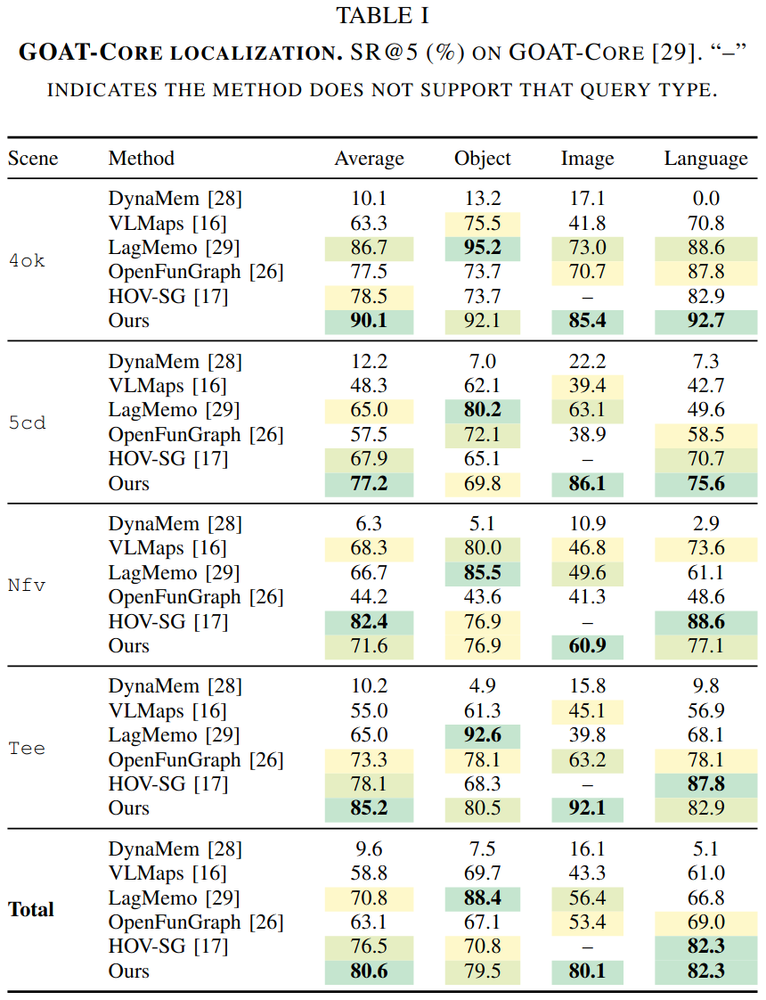
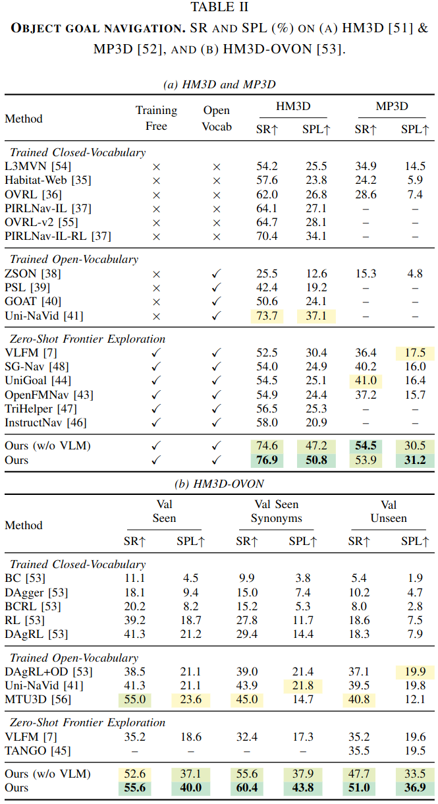
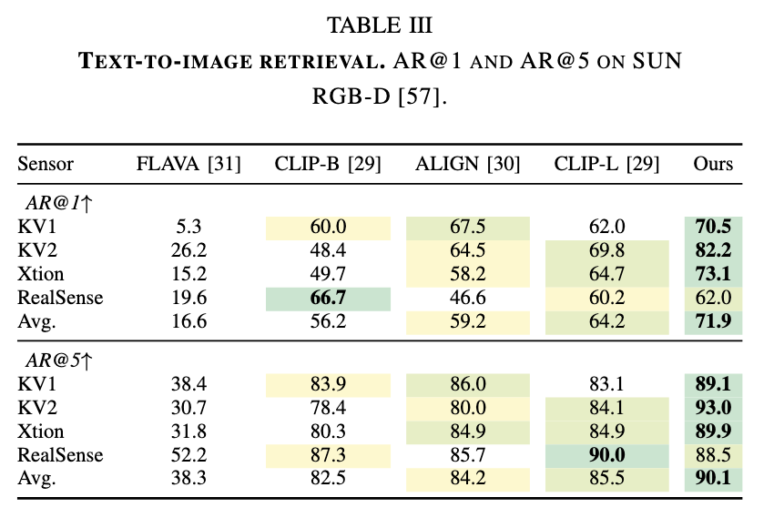
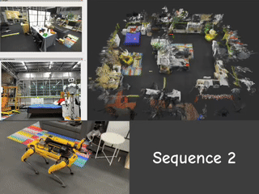

<p align="center">
  <h1 align="center">Memory Over Maps:<br>3D Object Localization Without Reconstruction</h1>
  <p align="center">
    <a href="https://ruizhou-cn.github.io/">Rui&nbsp;Zhou*</a>
    ·
    <a href="https://xanderyap.com/">Xander&nbsp;Yap*</a>
    ·
    Jianwen&nbsp;Cao
    ·
    <a href="https://allison-lau.vercel.app/">Allison&nbsp;Lau</a>
    ·
    <a href="https://boysun045.github.io/boysun-website/">Boyang&nbsp;Sun</a>
    ·
    <a href="https://cvg.ethz.ch/team/Prof-Dr-Marc-Pollefeys">Marc&nbsp;Pollefeys</a>
  </p>
  <p align="center"><strong>(* Equal Contribution)</strong></p>
</p>

---

<p align="center">
  <h3 align="center">
  <a href="https://arxiv.org/abs/2603.20530">Paper</a> |
  <a href="https://youtu.be/LOPlDtYiDms">Video</a> |
  <a href="https://ruizhou-cn.github.io/memory-over-maps/">Project Page</a> |
  <a href="docs/demo.md">Interactive Demo</a>
  </h3>
</p>

## Overview

Memory Over Maps is a reconstruction-free approach to 3D object localization and navigation using retrieval and VLM re-ranking over posed RGB-D streams.

## Real-Time Interactive Demo

<p align="center">
  
</p>

Real-time, interactive, open-vocabulary scene understanding from posed RGBD images alone — no 3D reconstruction or scene graph is required. Type any natural-language query — a rare object (*audio speaker*), a functional place (*where can I sleep?*, *where can I cook?*, *where can I eat?*), a material (*made of metal*), a physical property (*something that emits light*), an abstract concept (*cozy*, *festive*, *cluttered*), or a spatial relationship (*sofa next to the TV*, *door in the bedroom*) — and the corresponding regions are highlighted. The reconstructed mesh shown in the demo is purely for visualization.

Follow [docs/demo.md](docs/demo.md) to set up and play with the real-time demo yourself.

## Installation

### Clone and Install

```bash
git clone https://github.com/RuiZhou-cn/memory-over-maps.git
cd memory-over-maps
conda create -n MoM python=3.9 -y && conda activate MoM
bash scripts/install.sh
```

## Datasets

See [docs/data.md](docs/data.md) for download and setup instructions for all datasets (Goat-Core, HM3D, HM3D-OVON, MP3D, SUN RGB-D).

## Evaluation

The full pipeline (VLM + spatial fusion + multi-goal + keyframing) runs by default. Run any command with `--help` for the full list of options.

```bash
python -m src.cli.eval_goatcore
python -m src.cli.eval_hm3d
python -m src.cli.eval_ovon
python -m src.cli.eval_mp3d
python -m src.cli.eval_sunrgbd
```

> **Out of GPU memory?** Use a smaller VLM (e.g. `vlm.model: Qwen/Qwen2.5-VL-3B-Instruct`) and reduce `sam3.batch_size` in your config.

### Results

<details>
<summary><b>Table I — Goat-Core Localization.</b> SR@5 (%) across scenes and query types (Average, Object, Image, Language).</summary>
<br>
<p align="center">
  
</p>
</details>

<details>
<summary><b>Table II — Object Goal Navigation.</b> SR and SPL (%) on HM3D, MP3D, and HM3D-OVON.</summary>
<br>
<p align="center">
  
</p>
</details>

<details>
<summary><b>Table III — Text-to-Image Retrieval.</b> AR@1 and AR@5 (%) on SUN RGB-D across sensor types.</summary>
<br>
<p align="center">
  
</p>
</details>

## Real-World Experiments

<table>
  <tr>
    <td align="center">
      <br>
      <em>Sequence 1</em>
    </td>
    <td align="center">
      <br>
      <em>Sequence 2</em>
    </td>
  </tr>
</table>

## Repository Structure

```
src/
├── cli/              # Evaluation entry points (one per benchmark)
├── pipelines/        # Paper pipeline steps (retrieval → localization → navigation)
├── envs/             # Dataset-specific configs and loaders (HM3D, MP3D, Goat-Core, OVON)
├── evaluation/       # Metrics accumulators and evaluation helpers
├── models/
│   ├── vlm/          # Vision-language model (Qwen2.5-VL)
│   ├── retrieval/    # Feature extractors (SigLIP2, CLIP, ALIGN, FLAVA) + FAISS search
│   ├── navigation/   # DD-PPO PointNav policy + multi-goal agent
│   └── segmentation/ # SAM3 text-prompted segmentation
└── utils/            # Projection, geometry, data loading, keyframing, spatial fusion
demo/                 # Interactive 3D viewer (viser)
checkpoints/
└── navigation/
    └── pointnav_weights.pth   # DD-PPO PointNav policy weights
configs/              # YAML configs (per-benchmark eval + demo)
scripts/              # Install + data preparation
```

## Citation

If you use this code in your research, please cite:

```bibtex
@misc{zhou2026memorymaps3dobject,
      title={Memory Over Maps: 3D Object Localization Without Reconstruction},
      author={Rui Zhou and Xander Yap and Jianwen Cao and Allison Lau and Boyang Sun and Marc Pollefeys},
      year={2026},
      eprint={2603.20530},
      archivePrefix={arXiv},
      primaryClass={cs.RO},
      url={https://arxiv.org/abs/2603.20530},
}
```
